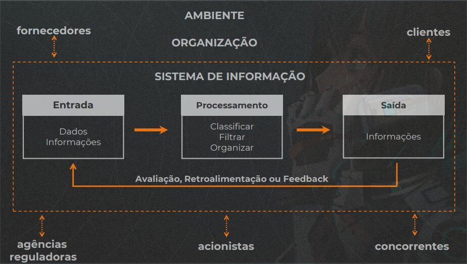

# Espera-se que:
- Diferencie dado, informação e conhecimento;
- Identifique os componentes de um Sistema de Informação;
- Compreenda a utilização e importância dos Sistemas de Informação.

# Dado, Informação e conhecimento

## O que e dado e informação ?

- Dados - **Fatos brutos** que descrevem as características de um evento.
    - Normalmente um dado esta articulado e relacionado a um rotulo, `nome = "Wesley"`
        - Rotulo: `nome`
        - Dado: `Wesley`
    - **Estrutura fundamental** sobre a qual um sistema e construído

> Dados por si so, nao nos trazem nada porem quando trabalhamos esses dados, articulamos os mesmo, eles passam a fazer sentido, e trazer significado, onde ai sim temos uma **Informação**

- Informação - **Processamento** ou **Organização** dos dados de tal forma que represente uma modificação no **conhecimento** das pessoas que a receberão.
> Informação e importante para que construa processos de conhecimento, para apoiar futuras tomadas de decisão
- Conjunto de dados cuja forma e conteúdo sao apresentados de maneira util para uso em um processo de **tomada de decisão**.

## Propriedades da Informação

Concedera-se uma informação valiosa/rica, quando ela **atende algumas características**.
    - Precisa - Isenta de erros
    - Completude - Informação tem que estar completa, contem todos os dados importantes e relevantes.
    - Econômica - Para transformar o dado em informação necessita de um custo beneficio relevante
    - Flexibilidade - Util para diversos momentos, reutilizável
    - Confiabilidade - Informação e confiável, a fonte dos dados e segura
    - Relevância - Importante e util
    - Simplicidade - Excesso de informação nao e interessante, tem que ser direta, clara
    - Oportunidade - Tal informação esta disponível no tempo que preciso
    - Verificável - Consigo validar, consigo verificar se a informação e real, concreta, precisa.
    - Acessível - Esta disponível quando necessário
    - Segura - Informação esta segura, consigo garantir sua proteção, so tem acesso quem tem a devida permissão.
> Importante saber as propriedades, pois o sistemas de informação que escolhermos para utilizar, tem que prover tais propriedades para min.

## O que e conhecimento

Capacidade de resolver problemas, inovar e **aprender** baseando-se em **experiencias previas**
> Experiencias previas podem ser relatórios, uma analise de dados que gerou informações relevantes

## O que e tecnologia da informação?

> Dados organizados de forma logica e inteligível sao as informações, que sao provenientes de eventos, objetos, acontecimentos, ou seja, **Fatos do mundo real**, este processo de aquisição, analise e comunicação vai gerar, produção de conhecimento, geração de valor e ajudar nas tomadas de decisão.
Para conseguir tudo isso de forma rápida, inteligente e segura, apenas usando as **Tecnologia da Informação**.

## O que e tecnologia da informação?

# O que e Sistemas de Informação? (SI)

Um conjunto de componentes inter-relacionados que **coletam** (ou recuperam), **processam**, **armazenam** e **distribuem** ***INFORMAÇÕES** destinados a apoiar a tomada de decisões, a coordenação e o controle de uma organização.

## Funcionamento Básico

> Basicamente um sistema de informações possui tres etapas, **entrada**, **processamento** e **Saida**
1. Entrada - Lançar ou registrar dados, dependendo do sistemas também e comum a entrada de informações
2. Processamento - Processamento dos dados e informações que entraram, a fim de obter um resultado.
3. Saida - Tera uma informação como saída.
- Pode se perceber que o Sistema de Informação (SI) continua, ele e cíclico, recebendo Avaliação, Retroalimentação ou Feedback.

## Interferência do Ambiente

> A organização possui o (SI) Sistema de Informação, e esta organização sofre interferência do ambiente que ela esta.
Elementos que afetam este Sistema de forma externa.
- Fornecedores
- Clientes
- Agencias Reguladoras
- Acionistas
- Concorrentes

## Dimensões dos Sistema de Informação

- Sistema de Informação nao e apenas tecnologia (Software, código)
- Organizações - Empresas que definem as regras os procedimentos, como funciona, seu segmento.
- Pessoas - Quem utiliza esse Sistema de Informação, analisa as informações, toma as decisões, faz o sistema funcionar
- Tecnologia - Como viabiliza, automatiza
- Conjunto inter-relacionado de organização, pessoas e tecnologia.

# Leitura Obrigatória

## [Capítulo 1: Introdução aos sistemas de informação, páginas 2 a 18.](https://integrada.minhabiblioteca.com.br/#/activate/9788522124107)

- Um conjunto de componentes inter‐relacionados que coleta, manipula, armazena e dissemina dados e informações e fornece mecanismo de realimentação (feedback) para atingir um objetivo.
- Informação é um dos recursos mais valiosos de uma organização. Esse termo, no entanto, é frequentemente confundido com dados.
- Os dados consistem em fatos brutos, como o número de funcionários, horas totais tra‐ balhadas em uma semana, números de peças no estoque ou pedidos de vendas.
- Informação é uma coleção de fatos organizados e processados de modo que tenham valor adicional, que se estende além do valor dos fatos individuais. Por exemplo, os gerentes de venda podem descobrir que saber o total de vendas mensais se ajusta mais a seus propósitos (isto é, é mais valioso) que conhecer a quantidade de vendas de cada representante.
- O tipo de informação criado depende das relações definidas entre os dados exis‐ tentes.
- O processo de definir relações entre os dados para criar informações úteis requer conhecimentos.
- Conhecimento é a consciência e compreensão de um conjunto de informações e maneiras como essas informações podem ser úteis para apoiar uma tarefa específica ou para chegar a uma decisão.
- Portanto, pode‐se também pensar a informação constituída de dados tornados mais úteis me‐ diante a aplicação de conhecimento.
- Em alguns casos, as pessoas organizam ou processam os dados mental ou manual‐ mente. Em outros casos, utilizam um computador. De onde vêm os dados ou como são processados é menos importante do que saber se são transformados em resultados úteis e valiosos.
- Sistema é um conjunto de elementos que interagem para realizar objetivos.
- Eficácia é uma medida do grau em que um sistema alcança suas metas.
- O mecanismo de realimentação é o componente que auxilia as organizações a alcançar seus objetivos, como aumentar os lucros ou melhorar os serviços ao cliente

# Complementar

## [Informação e conhecimento - Mario Sergio Cortella](https://www.youtube.com/watch?v=fuGAcDLmHZU&ab_channel=CanaldoCortella)

- Nao confundir informação com conhecimento
    - Usamos informação para construir o conhecimento
    - Estão conectados mas nao sao a mesma coisa
    - Informação - comutativa
    - Conhecimento - Seletivo
        - Aquilo que se torna seu, passa a pertencer a voce
- Necessário saber claramente aonde quer ir, o que almeja, senão ficara pulando de um lado para o outro sem construir nenhum conhecimento

## [A importância de dados para tomada de decisões](https://blog.xtree.com.vc/a-importancia-de-dados-para-tomada-de-decisoes/)

- se você, como líder, não tem uma ideia clara de onde quer chegar e não sabe medir essa trajetória, certamente terá resultados desapontadores.
- Porém, o “achismo” deveria se limitar a conversas entre amigos ou decisões de caráter pessoal. Não podemos levar esse hábito para dentro dos negócios.
- O sucesso é construído seguindo o processo correto, que pode ser aprendido e replicado.
- métricas de vaidade. Como o próprio nome diz, são números que seduzem por dar a versão mais agradável e otimista. Dados que documentam o estado atual da empresa/produto sem entrar a fundo na questão do caminho percorrido até chegar neste número ou do que fazer para seguir.
- Para um relatório ser considerado acionável, deve demonstrar causa e efeito claros. Caso contrário, é uma métrica de vaidade. Com métricas acionáveis, fica mais fácil entender porque os números caíram e o que fazer para evitar isso.
- deve-se assegurar que as informações sejam confiáveis para os funcionários, através de documentação e transparência.

## [Sistemas de Informações Gerenciais](../../ebooks/fundamentosSistemasInformacao/arte-sistemas-informacoes-gerenciais.pdf)

## [Date is The New Oil -- And That's A Good Thing](https://www.forbes.com/sites/forbestechcouncil/2019/11/15/data-is-the-new-oil-and-thats-a-good-thing/?sh=27f294b17304)