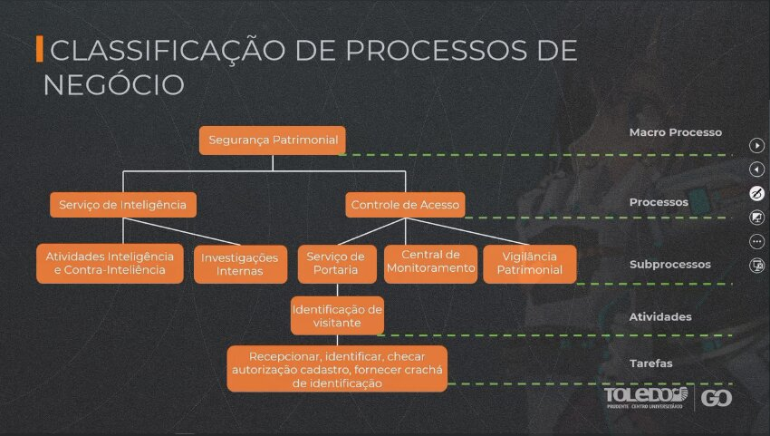
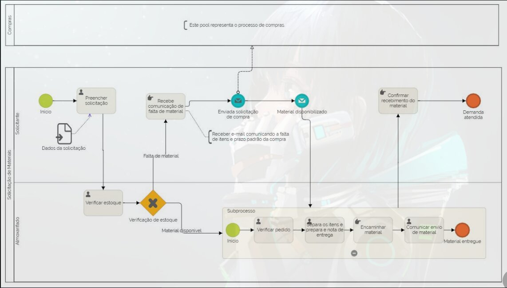
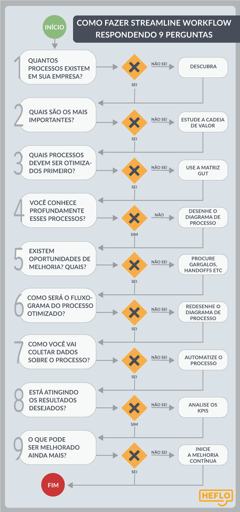

# Espera-se que voce:
- Compreenda o que é Gerenciamento de Processos de Negócio;
- Aplique conceitos, definições e características dos Processos de Negócio;
- Desenvolva senso crítico quanto a instrumentos de Gestão Organizacional.

# O que e?

- Negócios - Pessoas exercem **interação** para executar um conjunto de atividades, e essa atividade entrega **valor para os clientes** e gera **retorno as partes interessadas**

- Gerenciamento de processos de negócios - **Conjunto de praticas** que tem como objetivo trazer a **otimização dos processos**, aumentado os resultado e atribuindo **valor aos clientes**, decide quais sao as **melhores formas de aplicar** metodologias e ferramentas na gestão de processos, para isso ele se baseia nas **melhores praticas**.

- Valor - Relacionado a **percepção do cliente** sobre os **benefícios** que **determinado produto ou serviço entregou e/ou agregou**

- Melhores praticas - Melhor mecanismo, meio, forma, de fazer algo.

> A maior referencia para Gerenciamento de Processos de Negócios e o livro **BPM CBOK**
> A maior referencia para Gestão de projetos e o livro **PMBOK**

- Processo de Negocio - Segundo BPM CBOK e um trabalho que entrega valor para os clientes ou apoia e gerencia outros processos, esse trabalho pode ser pronta a ponta, interfuncional e ate mesmo interorganizacional

# Características do gerenciamento de Processos de Negocio
- Possui foco nas pessoas
- Todos os colaborados sao importantes para o resultado do processo
- Os processos dever ser vistos a partir de perspectiva do cliente
- Visa atuar como um elo entre a estrategia da empresa, os processos de negocio e a satisfação do cliente
- O gerenciamento de Processos de Negocio nao e algo simples de ser implantado pois requer uma mudança de cultura na empresa

# Classificação de processos de negocio

## Processos Primários
- Geram e entregam **valor para o cliente** de forma **direta**
- Referenciados como processos **essenciais ou finalísticos**, pois representam as atividades essências que uma organização **executa para cumprir sua missão.**
- Esses processos **constroem a percepção de valor pelo cliente** por estarem diretamente **relacionados a experiencia de consumo do produto ou serviço.**

## Processos de Suporte
- **Apoiam** os processos primários e os processos de gerenciamento
- Entregam **valor para outros processos** e **nao diretamente para os cliente**
- Comumente associados as **areas funcionais**, embora nao haja impedimento para que sejam interfuncionais.

## Processos de Gestão ou Gerenciamento
- **Coordenam os processos** primários e os processos de suporte
- Tem o proposito de para **medir, monitorar, controlar atividades e administrar o presente e o futuro do negocio**.
- **Nao agregam valor diretamente para os clientes**, mas sao necessários para assegurar que a **organização opere de acordo com seus objetivos e metas de desempenho**.
- Podem estar associados a areas funcionais ou serem intervencionais
- A classificação de processos surgiu a partir da **Cadeia de Valor** de *Michael Porter*, um instrumento que mostra em uma pagina **o que** a organização faz e **como** ela gera valor ao cliente.
- Objetivo: Identificar a vantagem competitiva de organização

# Classificação de processos de Negocio

Através do Gerenciamento de Processos de Negocio e possível :
- Enxergar facilmente os **gargalos na operação** ao verificar em quais etapas dos processos acontecem o **acumulo de tarefas**
- **Proporciona visão** mais clara dos hand-off (Troca de responsabilidades)
- Os hand-off sao os excessos de transição de processo entre os envolvidos
- Uma consequência dessa passagem de bastão e o enfileiramento(gargalos)
- Ela também pode gerar perdas, afetar o tempo de processo (lead-time) ee a satisfação do cliente.

# Benefícios relacionados aos processos de negocio

## Padronização de processos
- Documentação e publicação dos processos, **evitando erros** por causa de **falta de informação**
- Com o processos registrado ha **rapidez quando a duvidas**, **sintonia entre usuários**, **mitiga informacoes repetidas ou desconexas**
- Todos passam a executar suas **tarefas da mesma forma** e geram **previsibilidade**
- O desenho dos processos os torna **conhecidos por todos na empresa**, **facilitando o trabalho** de gestores e colaboradores.

## Disseminação da cultura de processos
- Compreensão e visão holística da organização, e clareza quanto aos impactos que as atividades podem causar no ambiente organizacional
- Os colaboradores mudam o **foco para o resultado global**, em vez de enxergar apenas os resultado local.

## Redução de Falhas e Desperdícios
- Mapear e transformar os processos reconhecer como trabalho e feito hoje na organização e **apontar melhorias nos processos**
- Melhorias **evitam ocorrência de falhas** e **minimizam os desperdícios nos processos**

## Mensuração de Resultados
- Além de definir processos, e preciso saber **medir e avaliar**
- Indicadores-Chave de performance (KPI's): ferramentas de gestão e medição de desempenho e sucesso de uma organização ou de um determinado processo.

## Melhora na Comunicação
- Participação de todos as **partes interessadas** nas **etapas** do gerenciamento de processos de Negocio
- No mapeamento e na transformação de processos fundamental a presença dos colaboradores envolvidos, proporcionando **troca de experiencias e maior empatia entre os colaboradores**

## Aumento da Satisfação do Cliente
- Por auxiliar na identificação de falhas nos processos e a melhorar a comunicação interna tem-se **resultados mais assertivos ao final do processo**
- Cliente terão boa percepção de valor e ficarão **mias satisfeitos com o produto ou serviço e experiencia de compra**

# Leitura

## [Cadeia de valor](https://www.heflo.com/pt-br/bpm/cadeia-de-valor/)
Para conseguir entregar mais valor, com o menor custo e sem perder a qualidade desejada pelo cliente – que se chama cadeia de valor.

A soma da cadeia de valor de cada empresa (da mineradora àquela que monta todas as peças e entrega o computador para você) se chama sistema de valor.

Tudo isso foi idealizado por um professor de Harvard, chamado Michael E. Porter. Por isso, a cadeia de valor também é chamada de cadeia de valor de Porter.

Entenda:
- A cadeia de valor gera custos (atividades primárias) e despesas (atividades de apoio).
- Gera também valor para o cliente final.

Se esse valor gerado for suficiente para o consumidor ou cliente pagar um montante monetário superior aos custos e despesas da cadeia de valor, a empresa terá lucro.

Para gerar valor para o cliente, **Porter definiu 3 estratégias empresariais competitivas** que chamou de genéricas: a diferenciação, a liderança em custos e a estratégia de foco ou nicho.
- Estrategia de diferenciação - A empresa procura satisfazer uma necessidade altamente valorizada por seus clientes de forma superior aos concorrentes. Ela procura ser a melhor supridora dessa necessidade para o mercado. Assim, se diferencia da concorrência e pode cobrar um preço premium pelo alto valor entregue aos clientes. Porém, tende a ter altos custos.
- Liderança em custos - Essa estratégia competitiva é usada por empresas que contam com alguma vantagem competitiva em seus processos produtivos que lhes permite ter custos menores. Dessa forma, pode vender mais barato. No entanto, é muito difícil se diferenciar da concorrência e produzir com qualidade praticando o foco em custos. Por isso, seus produtos não são diferenciados e suas margens costumam ser baixas.
- Foco - A estratégia competitiva de foco foge dos altos custos da estratégia de diferenciação e das baixas margens da estratégia de lideranças em custos buscando uma parcela restrita do mercado, um nicho que possa atender de forma especializada, com custos razoáveis e qualidade sob medida.

**Confira um processo de solicitação de compra que foi desenhado seguindo as técnicas de BPM para atingir a máxima eficiência:**

### Como funciona a melhoria contínua para reduzir custos e entregar qualidade?
A própria melhoria contínua é um processo do negócio. Assim, por meio da análise da cadeia de valor, descobrem-se quais processos têm mais potencial de diminuir custos ou de gerar mais satisfação para o cliente se forem melhorados.  

Para achar as oportunidades de melhoria de cada processo é preciso fazer o chamado mapeamento do processo.  

Deve-se coletar todos os documentos relativos ao processo, como formulários, manuais, checklists etc. e entrevistar-se todos àqueles que lidam diretamente com ele, a fim de se desenhar um diagrama do fluxo das atividades do processo como ele é hoje.  

buscam-se maneiras de torná-lo mais e ágil e eficiente.

Encontradas essas melhorias, o processo que se deseja implantar (melhorado e otimizado) é desenhado em um diagrama para que fique claro para todos.

Em seguida, por meio da automatização do processo, isto é, da coleta dos dados de performance do processo de forma automática, verifica-se se as melhorias implantadas realmente estão surtindo o efeito desejado (diminuição de custos e/ou aumento da qualidade).

Em caso positivo, as mudanças são mantidas. Aquelas que parecem não funcionar como planejado, são alvo de um novo processo de melhoria

Esse trabalho de melhoria de processos para torná-los mais fluídos e eficientes também é conhecido como **streamline workflow.**

## [Gestão da Qualidade - Conceitos e Técnicas (Capitulo 2, pag 30 a 48)](https://moodle.toledoprudente.edu.br/local/biblioteca-digital/minha-biblioteca.php?isbn=9788597006438/cfi/6/24!/4@0.00:0.00)

Daí a importância do conceito de abordagem científica para a tomada de decisão baseada em dados e fatos.

O conceito de foco no cliente relaciona-se com duas questões fundamentais: **trazer a visão do mercado sobre requisitos de produtos e serviços para dentro da empresa (market in); e garantir que toda a organização esteja focada no atendimento desses requisitos.** Isso implica em práticas de gestão voltadas para as seguintes questões principais:  
- Quem são os clientes?  
- Como identificar requisitos dos clientes e avaliar grau de atendimento desses requisitos?  
- Como focar a organização no atendimento dos requisitos?

Um ponto muito importante é que o conceito de foco no cliente se estende a outras partes interessadas, os *stakeholders*, do inglês. Nessa categoria de *stakeholders* se incluem, além dos clientes, os acionistas, parceiros da cadeia de suprimentos, funcionários, e em alguns casos agências reguladoras e organismos governamentais.

Stakeholder | Expectativas
---         | ---
Clientes    | Atendimento de Requisitos
Funcionários| Ambiente desafiador e gratificante; talento reconhecido; compensação financeira.
Cadeia de suprimentos | Acordos de longo prazo; relações mutuamente benéficas.
Acionistas  | Valor econômico; lucratividade; valorização da marca.
Agências reguladoras | Atendimento às normas vigentes, responsabilidade social.

Segundo *Juran*, todas as **funções desenvolvidas dentro de uma organização** incorporam três papéis: de **cliente**, que recebe de um fornecedor interno informações ou materiais para serem processados; de **processador**, que executa as atividades previstas; e de **fornecedor**, que entrega as informações ou produtos processados para o próximo cliente interno.

**Mais informações importantes, Marcado na biblioteca digital**

# Leituras Complementares
<https://integrada.minhabiblioteca.com.br/reader/books/9788582600665/pageid/0>
<https://integrada.minhabiblioteca.com.br/reader/books/9788597009149/epubcfi/6/2[%3Bvnd.vst.idref%3Dcover]!/4>
<https://integrada.minhabiblioteca.com.br/reader/books/9788597009149/epubcfi/6/2[%3Bvnd.vst.idref%3Dcover]!/4>