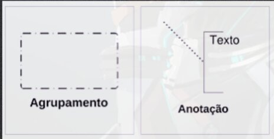
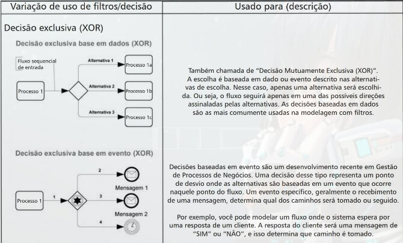
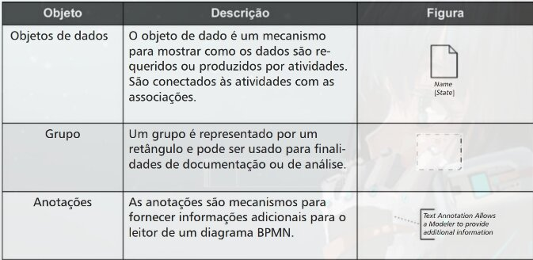

# Espera-se que voce:
- Aprenda sobre Modelagem;
- Conheça, diferencie e aplique as categorias de elementos da simbologia de fluxograma de processo BPMN (5).

# Categorias de Elementos de *BPMN*

*BPMN* feito através de um diagrama simples, com um pequeno conjunto de elementos gráficos, assim trazendo facilidade para os usuários, ficando de **fácil entendimento o fluxo e o processo**

# Categorias de elementos da simbologia de fluxograma de processos *BPMN*

## Objetos de Fluxo  
Definem quando um processo se **inicia, quanto termina, quais as tarefas que ocorrem** e os deviso no fluxo de tarefas, sao eles que **indicam o conteúdo do processo** 

**Sao Divididos em tres tipos:**  
**Eventos, Tarefas (Atividades), Gateways**
1. **Eventos:** Definem como o fluxo e **iniciado, executado e finalizado**

2. **Tarefas:** Compreendem ao **trabalho que e realizado dentro do processo**, mostram as **ações que devem ser desempenhadas**. Apresentam também diversas modalidades.
> Todas as tarefas possuem uma boa pratica usar um verbo mais substantivo
>

3. **Gateways:** Pontos de desvio que **determinam o caminho** que o processo (decisório) seguira dentro do fluxo.
> Também chamados de Diamantes.
> 

## Swim Lanes (Pista de Natação)

São os locais onde se **colocam os elementos de fluxo e os conjuntos de atividades**, dividindo-os em **raias que representam os departamentos ou participantes** responsáveis por determinadas tarefas.

1. **Piscina (Pool):** Representam processos e respectivos participantes (internos e externos). **Delimita fronteiras entre os processos e a forma de relacionamento.** Se possível, ao nomear, utilizar o nome do processo ou estrutura de trabalho (departamento).

2. **Raias (Lanes):** Cada piscina possui várias raias, que simbolizam os **papéis, áreas e responsabilidades no processo**

## Objetos de Conexão

Conectam diferentes elementos de fluxo, sendo:

1. **Fluxo de Sequencia** - **Conectam elementos de fluxo**, mostra em que ordem as atividades sao executadas
2. **Fluxo de Mensagem** - **Conectam piscinas** para troca de mensagens, indica quais as mensagens que fluem entre processos.
3. **Associação** - Conectam os artefatos aos objetos de fluxo.

## Elementos de Dados

Os elementos de dados **permitem visualizar** como e a **troca de informação** entre piscinas e elementos de fluxo, e como os **dados sao mantidos e armazenados**.

## Artefatos

Possibilitam **maior nível de detalhe** ao diagrama, pois permitem que **informações extras** sejam trazidas. Sao importantes para deixar o **diagrama mais claro para o leitor e/ou participantes.**

# Leitura

## Capítulo 7 - Business Process Modeling Notation (BPMN), páginas 77 a 93.

"como por exemplo, no caso da indústria de software e da engenharia, a escolha do BPMN ainda encontra resistência, pois esses setores têm preferido usar o UML (no caso da indústria de software) ou o IDEF (no caso da engenharia)."

- Mensagem: Uma mensagem chega de um participante e dispara o início do processo, ou continua o processo, no caso de um evento intermediário. Uma mensagem de fim indica uma mensagem gerada no fim de um processo.

- Marcador: Um tempo específico ou um ciclo (por exemplo, todo sábado às 14 horas) pode iniciar um pro- cesso ou continuá-lo, no caso de um evento intermediário

- Regra: Dispara quando as condições de uma regra se tornam uma verdade, como por exemplo, o volu- me de estoque cai a 5% da capacidade de armazenamento

- Conector: m link é um mecanismo de conexão de um fim de evento de um fluxo de processo para iniciar outro fluxo de processo.

- Múltiplo: ra iniciar múltiplos eventos, há vários modos de disparar um processo, ou continuá-lo, no caso de evento intermediário. Apenas um deles é requerido. Os atributos do evento definem que tipo de disparador se aplica. No caso de fim múltiplo, há múltiplas consequências de fim de processo (por exemplo, múltiplas mensagens enviadas).

- Exceção (evento apenas de meio ou fim): Uma exceção de fim de evento informa ao motor do processo que um chamado de erro deverá ser gerado. Esse erro será pego por uma exceção evento intermediário

- Compensação (evento apenas de meio ou fim): m evento de fim de compensação informa ao motor do processo que uma compensação é necessária. Esse identificador da compensação é usado em um evento intermediário quando o processo é desfeito.

- Cancelamento (Evento apenas de fim): m evento de fim significa que o usuário decidiu cancelar o processo. O processo é terminado com evento de fim normal.

