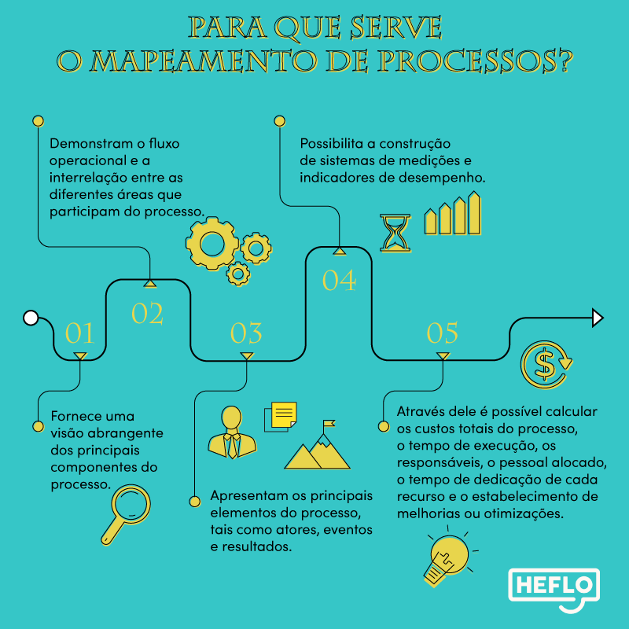
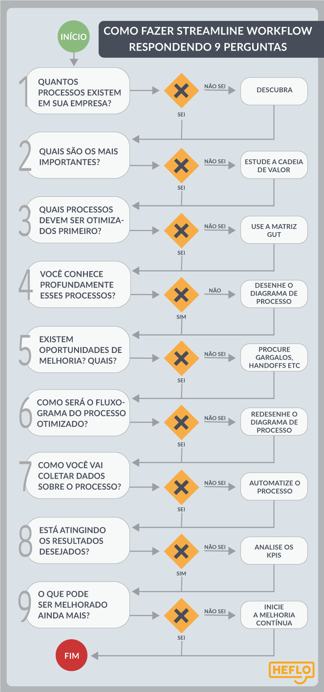

# Espera-se que:

- Desenvolva a primeira análise e modelagem de processo de negócio;
- Aplique categorias de elementos aprendidas, mecanizando a notação em sistema de informação;
- Interprete o texto e compreenda o problema proposto, mentalizando e aplicando no diagrama todos os princípios e regras.

# Exercício

A empresa XYZ é prestadora de serviços de tecnologia, especificamente serviços de internet banda larga (rede de fibra ótica moderna, rápida e estável). O cliente entra em contato com a equipe comercial e solicita cotação de determinado produto e/ou serviço (Passo 1: Contato do Cliente). A equipe comercial registra a demanda, elabora cotação e envia ao cliente para aprovação (Passo 2: Envio da Cotação). O cliente, de acordo, aprova a cotação e realiza o pedido de compra (Passo 3 - Aprovação). A aprovação gera uma ordem de serviço para a equipe técnica (Passo 4 – Prestação do Serviço). Após realizada a prestação dos serviços e atestada a conclusão, o cliente acima o termo de entrega e participa da pesquisa de satisfação (Passo 5 – Avaliação)

## Complementos

**Processo Primário**: Gera valor para o cliente! O cliente possui contato constante no processo, pois inicia, aprova e avalia o serviço. Internamente a empresa, há diversas equipes e departamentos trabalhando simultaneamente para que o produto/serviço seja devidamente entregue. O processo inicia de uma demanda com o cliente, e finaliza com a entrega de valor. Este processo é chamado Ponta a Ponta.

## Recomendações

Aplicar boas práticas! (Por exemplo, em Tarefas: Sempre associar ação ao Verbo + Substantivo)

## Ferramentas (Softwares)

- HEFLO
- DRAW.IO
- BIZAGI

## Como construir

1. **Defina as Responsabilidade**  
    Através de piscinas e raias, agrupar as tarefas e definir os responsáveis por elas
    > Piscinas e raias também sao chamados de *containers*
    >
    > Piscinas internas (sobre processos da sua empresa) sao chamadas de caixa branca, e Piscinas de processos externos (De terceiros, empresas de fora) sao chamadas de caixa preta, pois nao nos interessa o processo
2. **Inicie o Processo**  
    Ele indicará a forma de como o processo será iniciado
3. **Acrescentar Tarefas e Desvios**  
    Todos estes elementos determinam a lógica do processo, representam o processamento e transformação das ações
4. **Finalize o Processo**  
    Um evento encerrará todo o campo de ação, e trazer a conclusão
5. **Revise todo o Processo de Trabalho e Fluxos**  
    Faça a análise crítica e mentalize todas as ações para garantir que todo o mapeamento esteja concordante
    
## Solução Simples

## Solução Completa

# Leitura

## [O que e Mapeamento de processos BPM?](https://www.heflo.com/pt-br/mapeamento/mapeamento-de-processos/)

Para que uma empresa atinja o sucesso, primeiro deve-se garantir que ela tenha eficácia para depois assegurar acerca de sua eficiência. Este é o objetivo de um mapeamento de processos BPM

- Processo: Um processo é uma sequência de tarefas, ou atividades, que ao serem executadas transformam insumos em algo (resultado) com valor agregado. 

A execução de um processo de negócio consome recursos materiais e também humanos para agregar valor ao seu resultado final

Insumos são matérias-primas, produtos ou serviços vindos de fornecedores internos ou externos que alimentam o processo.

Os resultados dos processos são produtos ou serviços que vão ao encontro das necessidades de clientes internos ou externos

promover este processo com total efetividade, (eficiência + eficácia).

O mapeamento dos processos BPM possibilita e facilita a construção de sistemas de medições e indicadores de desempenho, avaliando em tempo real a execução das tarefas, medições dos resultados, custos, produção, produtividade, riscos, etc., tornando mais fácil o seu gerenciamento.

Mapeamento de processos **comporta duas fases**, como você verá em mais detalhes adiante. **Na fase AS IS, mapeia-se o processo com ele é hoje**. **Na fase TO BE, é criado o mapa do processo ideal, que se deseja alcançar.**

- Mapeamento de processos: implica maior precisão do que uma diagramação e tenderá a agregar maior detalhe acerca não somente do processo, mas também de alguns dos relacionamentos mais importantes com outros elementos, tais como atores, eventos e resultados. Mapas de processo tipicamente fornecem uma visão abrangente dos principais componentes do processo, mas variam de níveis mais altos para mais baixos de detalhamento.

Na fase AS IS, ele serve como guia para que todos os envolvidos entendam como ele é feito atualmente.

Ao se fazer o mapeamento TO BE, a equipe toda sabe o que está sendo proposto. Assim, além de terem uma visão clara, podem fazer sugestões e adendos, todos “falando a mesma língua”.

### Fases do Mapeamento de Processos BPM

- **Fase 1 - Definir equipes que possam apresentar a rotina**  
    Os participantes desse trabalho são principalmente as pessoas que realizam o processo no dia a dia. Recomenda-se também a participação de pessoas do processo fornecedor e do processo cliente  
    Assim, reúna uma equipe multidisciplinar que tenha integrantes como estes:  
    - Clientes do processo: pessoas ou áreas que receberão as saídas do processo
    - Fornecedores do processo: colaboradores ou áreas que tem o processo como clientes
    - Os colaboradores que efetivamente pµoe a mão an massa e fazem o processo acontecer
    - Analista de processos de negócios: os técnicos que entendem o BPM à fundo
    - Consultores de processos: colaboradores sênior e que tem ampla experiência na análise de processos de negócios
    - Os gestores desse processo
    - Os gestores que serão clientes do processo  

- **Fase 2 – Identificar processos**  
    Obter amplo conhecimento acerca da organização levantando as seguintes informações:  

    - Estrutura organizacional, as atribuições de cada área e os principais gestores.
    - Estratégia de crescimento de cada setor.
    - Principais processos de negócio.
    - Principais indicadores de desempenho.
    - Sistemas de informações utilizados na organização.
    - Prioridades estratégicas de implantação de processos.
    - Estratégias de terceirização de processos.  

    Isso quer dizer que antes de mapear os processos, é preciso alinhar seus objetivos com os objetivos estratégicos organizacionais.  
    Afinal, os processos estão inseridos dentro do contexto da empresa. Não são peças isoladas. Portanto, simplesmente mapeá-los sem entender como entregam valor ao processo seguinte e, consequentemente, ao cliente final, não trará os resultados desejados.

- **Fase 3 - Identificar processos atuais**  
    Levantar dados sobre as políticas que regem os processos, as tarefas executadas, tempos gastos nas atividades, quantidade de pessoas envolvidas em cada atividade, quem são os fornecedores e respectivos clientes internos e quais as suas interações.  
    Nesta fase não é obrigatória a diagramação dos fluxos, um simples texto em português estruturado é suficiente para formalizar a fase

- **Fase 4 – Analisar processo atual e propor melhorias**
    Análise crítica dos processos para detectar as causas dos problemas e as oportunidades de melhoria no processo. Fontes de problemas e oportunidades:  
    - Método de trabalho.
    - Pessoas.
    - Máquinas e equipamentos.
    - Matéria prima.
    - Ambiente físico.

    Ferramentas disponíveis:

    - Brainstorming.
    - Diagrama de Pareto.
    - Diagrama de Ishikawa ou Diagrama de Causa – Efeito.

- **Fase 5 – Mapear fluxos To Be**
    Desenvolver alternativas de solução para os problemas do processo. Avaliar cada alternativa em função dos seus
    - impactos sobre:
    - Custo-benefício.
    - Prazo de implantação.
    - Quadro de pessoa.
    - Outros.

    Também nesta fase:

    - Decidir pela melhor alternativa de melhoria.
    - Diagramar a nova versão do processo.
    
- **Fase 6 - Priorizar e Automatizar**
    Identificar os processos prioritários para implantação e automatização. Automatização de processos de negócios, ao contrário do que muitos pensam, não se trata apenas de substituir tarefas manuais por automatizadas, através de softwares, por exemplo.

    Um dos mais importantes papéis da automatização é dar acesso aos gestores e outros colaboradores aos dados de performance do processo, os chamados KPIs, ou indicadores-chave de performance.

    Com eles analisados em tempo real, a tomada de decisão é muito mais precisa e ágil. Além disso, é possível corrigir os rumos, sempre que se perceber que as metas não estão sendo atingidas.
    
- **Fase 7 - Monitorar, melhorar e expandir automatização**
    Realizar reuniões periódicas para acompanhamento de indicadores e sugestões de melhoria. Afinal, se você tem acesso aos dados em tempo real, deve usá-los da melhor forma.  
    Assim, diga este passo a passo:

    - Criar processos para registro e tratamento de mudanças em processos.
    - Estabelecer um comitê de mudanças de processos.
    - Manter controle de versão de processos.
    - Identificar novos processos para automatização e repetir o passo anterior.

## Leitura interessantes

<https://www.heflo.com/pt-br/bpm/como-mapear-processos-passo-a-passo/>
<https://www.heflo.com/pt-br/mapeamento/tipos-de-mapeamento-de-processos/>
<https://www.siteware.com.br/metodologias/diagrama-de-ishikawa/>